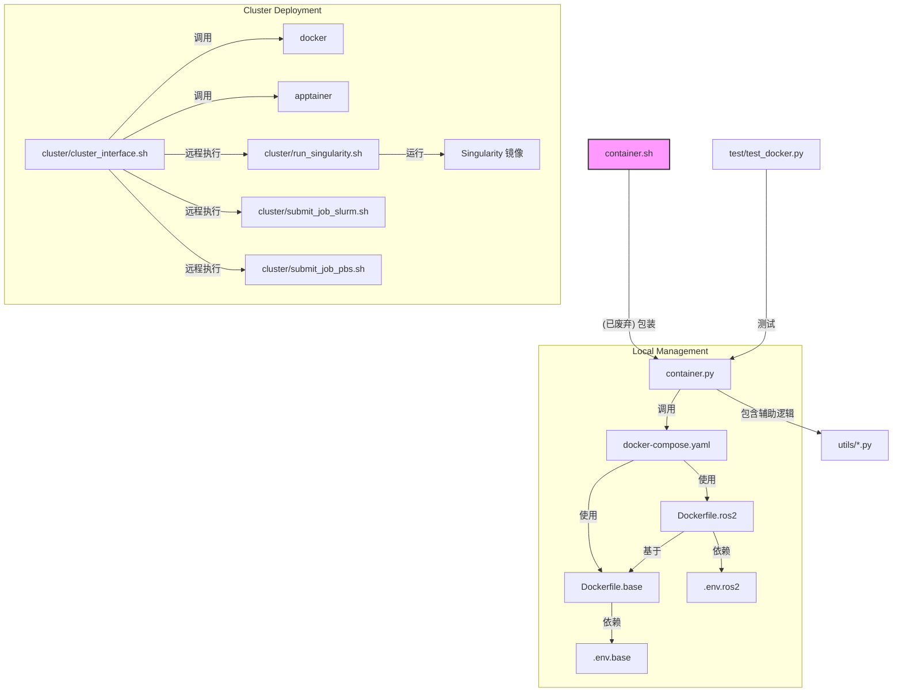

# IssacLab 容器化环境文档

本文档旨在详细说明 `IssacLab` 目录下的文件结构、功能及其使用方法。

## 1. 功能概述

`IssacLab` 目录提供了一套完整的容器化环境管理方案，主要用于支持 NVIDIA Isaac Lab 的开发与部署。其核心功能包括：

1.  **本地开发环境管理**: 通过 `Docker Compose` 和 `Python` 脚本，用户可以轻松地在本地构建、启动、进入和停止 Isaac Lab 的 Docker 容器。支持基础环境和带有 ROS2 的环境。
2.  **计算集群部署**: 提供了一套工具链，能够将本地构建好的 Docker 镜像转换为 `Singularity (Apptainer)` 镜像，并将其推送到计算集群（支持 SLURM 和 PBS 任务调度系统）上运行任务。

该方案通过将复杂的环境配置封装在容器中，极大地简化了开发和部署流程，保证了环境的一致性。

## 2. 文件结构与关系

`IssacLab` 目录下的文件和子目录协同工作，构成了一个完整的系统。其主要关系如下图所示：



-   **本地管理**:
    -   用户主要通过 `container.py` 脚本与系统交互。
    -   `container.py` 解析用户命令（如 `start`, `stop`），并调用 `docker compose` 命令。
    -   `docker-compose.yaml` 定义了服务（如 `isaac-lab-base`, `isaac-lab-ros2`），并指定了用于构建这些服务的 `Dockerfile` (`Dockerfile.base`, `Dockerfile.ros2`)。
    -   `.env.*` 文件为 `docker-compose.yaml` 和 `Dockerfile` 提供了构建时和运行时的环境变量。
-   **集群部署**:
    -   用户通过 `cluster/cluster_interface.sh` 脚本进行集群操作。
    -   `push` 命令使用 `apptainer` (Singularity 的继任者) 将本地 Docker 镜像打包成 `.sif` 文件，并上传到集群。
    -   `job` 命令通过 `ssh` 连接到集群，并使用 `submit_job_*.sh` 脚本提交一个任务。
    -   任务脚本最终会调用 `run_singularity.sh`，在计算节点上启动 Singularity 容器并执行指定的 Python 脚本。

## 3. 各文件功能说明

| 文件/目录                               | 功能说明                                                                                                                               |
| --------------------------------------- | -------------------------------------------------------------------------------------------------------------------------------------- |
| `container.py`                          | **核心管理脚本**。用于本地 Docker 容器的生命周期管理，包括构建、启动、停止、进入容器、复制文件等。是用户在本地交互的主要入口。         |
| `container.sh`                          | (已废弃) 一个简单的 bash 包装脚本，其功能是直接调用 `container.py`。建议直接使用 `container.py`。                                      |
| `docker-compose.yaml`                   | 定义了 Docker 服务的配置文件。它描述了如何构建 `base` 和 `ros2` 两种镜像，以及容器运行时的配置，如卷挂载、环境变量和网络模式。       |
| `Dockerfile.base`                       | 用于构建基础 `isaac-lab-base` 镜像的 Dockerfile。它基于官方的 Isaac Sim 镜像，安装了编译工具、依赖库，并设置了 Isaac Lab 的基本环境。 |
| `Dockerfile.ros2`                       | 用于构建 `isaac-lab-ros2` 镜像的 Dockerfile。它在 `isaac-lab-base` 镜像的基础上，安装了 ROS2 Humble 及其相关工具。                  |
| `.env.base`                             | 存储基础环境变量，如 Isaac Sim 的版本、基础镜像名称、容器内路径等。                                                                    |
| `.env.ros2`                             | 存储 ROS2 相关的环境变量，如要安装的 ROS2 包类型、RMW 实现等。                                                                         |
| `.env.cloudxr-runtime`                  | 为 NVIDIA CloudXR 服务提供环境变量。                                                                                                   |
| `docker-compose.cloudxr-runtime.patch.yaml` | 一个 `docker-compose` 的补丁文件，用于在需要时集成 CloudXR 服务。                                                                      |
| `x11.yaml`                              | `docker-compose` 的配置文件，用于启用 X11 转发，允许在容器内运行图形界面应用。                                                         |
| `.ros/`                                 | 包含 ROS2 中间件 (DDS) 的配置文件 (`fastdds.xml`, `cyclonedds.xml`)，这些文件会被复制到容器中。                                        |
| `test/test_docker.py`                   | 使用 `pytest` 编写的测试脚本，用于验证 `container.py` 的 `start` 和 `stop` 功能是否对不同 profile 正常工作。                          |
| `utils/`                                | 包含 `container.py` 使用的 Python 辅助模块。                                                                                           |
| `utils/container_interface.py`          | 封装了与 Docker Compose 命令的交互逻辑。                                                                                               |
| `utils/state_file.py`                   | 一个简单的状态管理工具，用于在 `.container.cfg` 文件中读写配置（如 X11 是否启用）。                                                      |
| `utils/x11_utils.py`                    | 包含了检查和配置 X11 转发的辅助函数。                                                                                                  |
| `cluster/`                              | **集群部署工具目录**。                                                                                                                 |
| `cluster/cluster_interface.sh`          | **集群交互入口脚本**。提供了 `push` 和 `job` 两个命令，分别用于推送镜像和提交任务。                                                      |
| `cluster/.env.cluster`                  | 集群相关的环境变量，如集群登录地址、任务调度器类型 (SLURM/PBS)、集群上的路径等。                                                        |
| `cluster/run_singularity.sh`            | 在计算节点上执行的脚本。它负责设置必要的目录和绑定，然后使用 `singularity exec` 命令启动容器并执行任务。                                 |
| `cluster/submit_job_pbs.sh`             | 为 PBS 任务调度系统生成并提交任务脚本的模板。                                                                                          |
| `cluster/submit_job_slurm.sh`           | 为 SLURM 任务调度系统生成并提交任务脚本的模板。                                                                                        |

## 4. 使用说明

### 4.1 本地容器管理

本地管理通过 `container.py` 脚本完成。

**1. 构建并启动容器**

-   启动基础容器 (不含 ROS2):
    ```bash
    python3 IssacLab/container.py start base
    ```
-   启动带 ROS2 的容器:
    ```bash
    python3 IssacLab/container.py start ros2
    ```
    此命令会自动构建 Docker 镜像（如果不存在）并在后台启动容器。

**2. 进入容器**

-   进入正在运行的 `base` 容器:
    ```bash
    python3 IssacLab/container.py enter base
    ```
-   进入正在运行的 `ros2` 容器:
    ```bash
    python3 IssacLab/container.py enter ros2
    ```

**3. 停止并移除容器**

-   停止并移除 `base` 容器:
    ```bash
    python3 IssacLab/container.py stop base
    ```
-   停止并移除 `ros2` 容器:
    ```bash
    python3 IssacLab/container.py stop ros2
    ```

**4. 自定义名称后缀**

你可以使用 `--suffix` 参数为容器和镜像添加自定义后缀，方便管理多个不同版本的环境。

```bash
# 启动一个名为 isaac-lab-ros2-my-test 的容器
python3 IssacLab/container.py start ros2 --suffix my-test
# 进入该容器
python3 IssacLab/container.py enter ros2 --suffix my-test
```

### 4.2 集群部署

集群部署通过 `cluster/cluster_interface.sh` 脚本完成。

**前提条件:**

1.  本地已安装 `docker` 和 `apptainer` (Singularity)。
2.  已配置好 `cluster/.env.cluster` 文件，填入正确的集群登录信息和路径。
3.  本地和集群之间已配置好 SSH 免密登录。

**1. 推送镜像到集群**

首先，在本地构建好你需要的 Docker 镜像（例如 `ros2` profile）。

```bash
# 在本地构建镜像
python3 IssacLab/container.py start ros2
# 停止容器（只需构建镜像，无需运行）
python3 IssacLab/container.py stop ros2
```

然后，使用 `push` 命令将镜像打包并上传。

```bash
# 将 isaac-lab-ros2:latest 镜像推送到集群
bash IssacLab/cluster/cluster_interface.sh push ros2
```
此命令会：
-   使用 `apptainer` 将 `isaac-lab-ros2:latest` Docker 镜像转换为 `isaac-lab-ros2.sif`。
-   将 `.sif` 文件打包成 `.tar` 文件。
-   通过 `scp` 将 `.tar` 文件上传到 `.env.cluster` 中指定的 `CLUSTER_SIF_PATH` 目录。

**2. 提交任务到集群**

使用 `job` 命令提交任务。

```bash
# 提交一个默认任务，使用 ros2 profile
bash IssacLab/cluster/cluster_interface.sh job ros2

# 提交任务并传递参数给你的 Python 脚本
bash IssacLab/cluster/cluster_interface.sh job ros2 --task Ant --num_envs 256
```
此命令会：
-   通过 `rsync` 将当前的 Isaac Lab 项目代码同步到集群。
-   通过 `ssh` 在集群上执行 `submit_job_*.sh` 脚本，提交一个新任务。
-   任务调度器会在计算节点上分配资源，并执行 `run_singularity.sh` 脚本，最终在 Singularity 容器中运行 `.env.cluster` 中定义的 `CLUSTER_PYTHON_EXECUTABLE` 脚本。

## 5. 注意事项

1.  **脚本废弃**: `container.sh` 是一个废弃的脚本，请始终使用 `container.py`。
2.  **X11 转发**: 首次运行 `start` 命令时，系统会询问是否启用 X11 图形界面转发。选择 `y` 后，配置会保存在 `.container.cfg` 文件中。如果遇到图形界面问题，可以检查该文件或 `x11.yaml` 的配置。
3.  **集群配置**: 在使用集群部署功能前，**必须**仔细配置 `cluster/.env.cluster` 文件中的所有变量，特别是集群地址、用户名、路径和任务调度器类型。
4.  **Singularity/Apptainer**: 集群部署流程依赖于 `apptainer`。请确保本地已正确安装。
5.  **网络模式**: `docker-compose.yaml` 中默认使用 `network_mode: host`，这意味着容器将共享主机的网络栈。这对于 ROS2 通信很方便，但也可能引起端口冲突。

## 6. container.py 说明

`container.py` 是一个核心管理脚本，主要用于本地 Docker 容器的生命周期管理，包括构建、启动、停止、进入容器、复制文件等。以下是其主要功能：

1. **选择配置文件**：根据你提供的 profile (如 `ros2`)，它会加载对应的 `.env` 文件 (如 `.env.base` 和 `.env.ros2`)。
2. **处理名称后缀**：将 `--suffix` 参数转换为一个名为 `DOCKER_NAME_SUFFIX` 的环境变量，传递给 `docker compose`，用于构建镜像和容器的名称。
3. **处理 X11 转发**：如果启用了 X11，它会自动添加 `-f x11.yaml` 参数并设置所需的环境变量。
4. **执行 `docker compose` 命令**：调用 `up`, `down`, `exec` 等命令。

### 核心命令转换

以下是如何直接使用 `docker` 命令来替代 `container.py` 的方法：

#### 1. 启动容器 (等同于 `start`)

`container.py` 的 `start` 命令对应于 `docker compose up --build -d`。你需要手动指定 profile 和 env 文件，并通过环境变量设置后缀。

**`container.py` 命令**:

```bash
python3 IssacLab/container.py start ros2 --suffix my-test
```

**等效的 `docker compose` 命令**:

```bash
DOCKER_NAME_SUFFIX="-my-test" \
docker compose \
  -f IssacLab/docker-compose.yaml \
  --profile ros2 \
  --env-file IssacLab/.env.base \
  --env-file IssacLab/.env.ros2 \
  up --build -d
```

#### 2. 进入容器 (等同于 `enter`)

`container.py` 的 `enter` 命令对应于 `docker exec`。你需要自己拼接出容器的名称。

**`container.py` 命令**:

```bash
python3 IssacLab/container.py enter ros2 --suffix my-test
```

**等效的 `docker exec` 命令**:

```bash
docker exec -it isaac-lab-ros2-my-test bash
```

#### 3. 停止并移除容器 (等同于 `stop`)

`container.py` 的 `stop` 命令对应于 `docker compose down --volumes`。

**`container.py` 命令**:

```bash
python3 IssacLab/container.py stop ros2 --suffix my-test
```

**等效的 `docker compose` 命令**:

```bash
DOCKER_NAME_SUFFIX="-my-test" \
docker compose \
  -f IssacLab/docker-compose.yaml \
  --profile ros2 \
  --env-file IssacLab/.env.base \
  --env-file IssacLab/.env.ros2 \
  down --volumes
```

### 如何处理 X11 图形界面

如果你需要图形界面，`container.py` 会自动为你加载 `x11.yaml`。手动操作时，你也需要添加这个文件。

**启动带 X11 的容器**:

```bash
# 1. 允许本地 Docker 连接 X server
xhost +local:docker

# 2. 运行 docker compose 命令，额外添加 x11.yaml
DOCKER_NAME_SUFFIX="-my-test" \
docker compose \
  -f IssacLab/docker-compose.yaml \
  -f IssacLab/x11.yaml \
  --profile ros2 \
  --env-file IssacLab/.env.base \
  --env-file IssacLab/.env.ros2 \
  up --build -d
```

`x11.yaml` 文件会自动处理 `DISPLAY` 等环境变量和卷挂载，所以你通常不需要手动设置它们。
